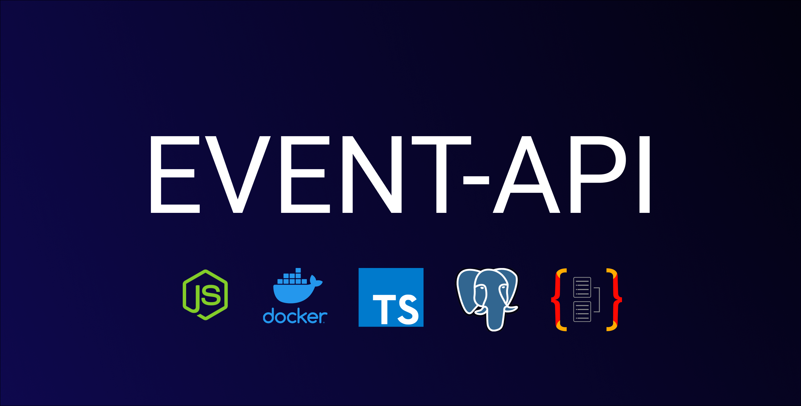

# eventapi

<!---Esses são exemplos. Veja https://shields.io para outras pessoas ou para personalizar este conjunto de escudos. Você pode querer incluir dependências, status do projeto e informações de licença aqui--->




> API Rest full para gerencimento de eventos e compras de ingressos.


### Features
  * Account
    - [✓] Criação de conta gestora
    - [✓] Criação de conta
    - [✓] Listagem de contas
    - [✓] Autenticação
  * Company
    - [✓] Criação de empresa
    - [✓] Listagem de empresas
  * Event
    - [✓] Criação de evento
    - [✓] Listagem de eventos
    - [✓] Listagem de eventos por empresa
  * Ticket
    - [✓] Criação de ingressos
    - [✓] Compra de ingressos
    - [✓] Listagem de ingressos por evento


## Endpoints
 * Documentação dos endpoints com swagger disponivel na seguinte rota <http://localhost:{SERVER_PORT}/{SWAGGER_URL}>
## 💻 Pré-requisitos

* Docker
* NodeJs
* Npm


## 💻 Técnologias utilizadas

* Docker
* NodeJs
* NestJs
* Typescript
* Typeorm
* Postgres
* Bcrypt
* Jsonwebtoken
## Princípios
* Single Responsibility Principle (SRP)
* Liskov Substitution Principle (LSP)
* Interface Segregation Principle (ISP)
* Dependency Inversion Principle (DIP)
* Keep It Simple, Silly (KISS)


## 🚀 Instalando o projeto

Para instalar o projeto event-api, siga estas etapas:

Clone o repositorio:
```bash
  git clone https://github.com/bernardorz/event-api.git
```

Navegue ate o diretorio do repositorio:
```bash
cd event-api
```


## Diagrama de entidade simples para entidendimento 


## Consumir & Testar

* Para testar a aplicação utilize o usuario admin para se authenticar

```json
  "email": "admin@email.com",
  "password": "admin"
```

Authenticado com esse usuario, siga o seguinte flow

>Criar empresa> Criar Manager> Criar Evento> Criar Ingresso

! Ponto importante, para criar um usuario comum, não precisa estar autenticado, somente se for criar um manager.

> METHOD POST
> * api/account/manager 
> * api/account/

## ☕ Como rodar a aplicação

Para rodar a <span style="color:purple"> API </span>, siga estas etapas:


* Crie um arquivo . env na raiz do projeto
* Preencha o .env de acordo com o .env.example

* Rode o seguinte comando e sua aplicação ira ser criada em um container docker e disponiblizada na porta que você configurou no .env
```
npm run compose:up
``` 


## Observação
> Caso você esteja utilizando o insomnia para testar, pode importar pelo insomnia a collection disponivel no arquivo Insomnia.json

## 📝 Licença

Esse projeto está sob licença.

[⬆ Voltar ao topo](#eventapi)<br>
